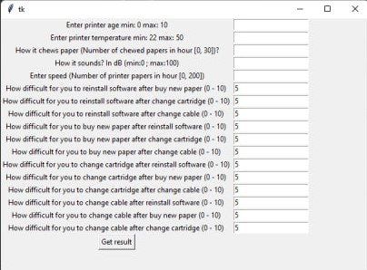

# LAB 1 Gybrid intellectual systems

In this lab created expert system that gets expert decision of problems with printer based
on some symptoms. User indicates which symptoms are present and enters some numeric data
characterizing these symptoms. Then user enters how difficult for him is to apply some
solutions (for example to change cartridge after changing cabel or other) and gets result.

GIF presenting work:

